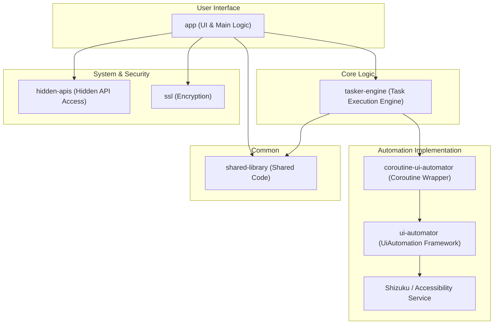

# AutoTask 项目分析报告

## 1. 项目概述

**AutoTask** 是一个 Android 平台上的自动化任务工具，专注于帮助用户执行自动化的屏幕操作。根据 `README.md` 的描述，该应用的核心特点是支持 **Shizuku** 和 **无障碍服务** 两种操作模式，从而实现无需 Root 的高权限自动化能力。

项目的主要功能包括：

- **多种启动模式**：支持 Shizuku 和无障碍服务，提供了灵活性和强大的控制能力。
- **任务管理**：支持常驻任务和一次性任务。
- **手势与布局**：支持手势录制和审查UI布局树，便于创建和调试任务。
- **高效稳定**：基于事件驱动和 Kotlin 协程，保证了低资源占用和后台常驻能力。
- **现代化UI**：遵循 Material 3 设计风格，界面美观易用。
- **开源安全**：代码完全开源，增强了项目的透明度和可信度。

## 2. 架构设计

该项目采用模块化的多仓库（Multi-module）架构，将不同的功能和层次清晰地分离到各个独立的 Gradle 模块中。这种设计提高了代码的可维护性、复用性和编译效率。

### 2.1. 模块划分

根据 `settings.gradle` 和 `app/build.gradle` 的定义，项目主要包含以下模块：

- **`:app`**：主应用程序模块，是用户交互的入口。它集成了所有其他模块，负责 UI 展示、用户交互、任务调度和两种自动化服务的管理。
- **`:tasker-engine`**：任务引擎模块，是项目的核心逻辑所在。它负责任务的解析、执行和管理，但不直接与 Android UI 自动化 API 交互。
- **`:coroutine-ui-automator`**：基于协程的 UI Automator 封装库。它为上层提供了更现代化、更易于使用的 API 来执行 UI 操作，并利用协程来处理异步和长时间运行的任务。
- **`:ui-automator`**：对 Android 原生 `UiAutomation` 框架的封装或扩展，可能是为了兼容性或功能增强。
- **`:hidden-apis`**：用于访问 Android 系统的隐藏 API（Hidden APIs）。这通常用于实现一些标准 SDK 无法实现的高级功能。
- **`:shared-library`**：通用代码库，存放被多个模块共享的工具类、常量或扩展函数。
- **`:ssl`**：安全相关模块，通过 JNI 调用 C/C++ 代码实现加密/解密功能（如 AES, MD5, Base64），用于保护应用数据的安全。

### 2.2. 总体架构图

## 3. 概要设计

### 3.1. 核心工作流

1.  **用户创建任务**：用户通过 `:app` 模块提供的 UI 界面创建自动化任务，例如录制手势、定义点击位置或设置条件。
2.  **任务持久化**：任务被序列化后存储在本地。
3.  **选择模式并启动服务**：用户选择 Shizuku 或无障碍服务模式，并启动对应的后台服务 (`ShizukuAutomatorService` 或 `A11yAutomatorService`)。
4.  **任务调度**：后台服务通过 `:tasker-engine` 模块加载任务。
5.  **任务执行**：
    -   `:tasker-engine` 解析任务指令。
    -   通过 `:coroutine-ui-automator` 将指令转换为具体的 UI 操作（如点击、滑动）。
    -   最终由 Shizuku 或无障碍服务执行这些操作。

### 3.2. 关键技术栈

- **语言**：主要使用 Kotlin，利用其协程、扩展函数等现代化特性。原生部分使用 C/C++。
- **UI**：遵循 Google 最新的 Material 3 设计规范，使用 `DataBinding` 来构建响应式 UI。
- **异步处理**：广泛使用 Kotlin Coroutines (`kotlinx-coroutines`) 来处理后台任务和 UI 交互，避免阻塞主线程。
- **依赖注入**：虽然未明确指定框架，但模块化本身就是一种控制反转的体现。
- **构建系统**：使用 Gradle 进行依赖管理和项目构建。
- **高权限操作**：
    - **Shizuku**：通过 `dev.rikka.shizuku:api` 与 Shizuku 服务通信，获取高权限来运行 `UiAutomation`。
    - **Hidden API Bypass**：使用 `org.lsposed.hiddenapibypass` 库绕过 Android P 及以上版本的隐藏 API 限制。

## 4. 详细设计

### 4.1. `tasker-engine` 模块：任务的心脏

`tasker-engine` 是整个项目的逻辑核心，它定义了任务的结构、行为和运行时。其设计高度抽象，完全独立于任何具体的UI操作框架。

- **核心模型 `Applet`** (`applet/base/Applet.kt`):
    - 这是所有操作（Action）和条件（Criterion）的基类，是任务的最基本单元。
    - 每个 `Applet` 拥有 `id`, `relation` (AND/OR), `references` (输入), `values` (参数), `referents` (输出) 等属性。
    - `apply(runtime)` 是其核心抽象方法，用于在给定的任务运行时中执行自身逻辑。

- **`Flow` 与控制流** (`applet/base/Flow.kt`):
    - `Flow` 是 `Applet` 的一个子类，也是一个可以包含其他 `Applet` 的容器。
    - `RootFlow` 是任务的根节点，`If`, `Else`, `Loop` 等都是 `Flow` 的具体实现，用于构建复杂的逻辑控制流（如条件判断、循环等）。
    - 这种设计形成了一个**解释器模式**，`Flow` 的嵌套构成了一个抽象语法树（AST），任务执行的过程就是遍历并解释这棵树的过程。

- **`Criterion` 与 `Action`** (`applet/criterion/Criterion.kt`, `applet/action/Action.kt`):
    - **`Criterion` (条件)**: `Applet` 的子类，用于判断。例如“屏幕是否亮着”、“前台应用是否是某个App”。它的 `apply` 方法返回成功或失败的 `AppletResult`。
    - **`Action` (动作)**: `Applet` 的子类，用于执行操作。例如“点击”、“滑动”、“返回”。

- **任务的运行时 `TaskRuntime`** (`runtime/TaskRuntime.kt`):
    - 这是任务在执行期间的上下文，包含了当前运行状态、协程作用域 (`CoroutineScope`)、变量注册表 (`ValueRegistry`)、当前执行到的 `Applet` 索引等。
    - 它负责管理 `Applet` 之间的值传递（通过 `references` 和 `referents`），并跟踪整个执行过程。
    - `TaskRuntime` 被设计为可池化、可回收的对象，以提高性能。

- **任务的表示 `XTask`** (`task/XTask.kt`):
    - 代表一个完整的自动化任务，包含 `Metadata` (元数据，如名称、作者) 和一个 `RootFlow` (任务逻辑树)。
    - `XTask` 负责管理自身的生命周期（启动、暂停、停止），并持有一个 `TaskRuntime` 实例来执行 `RootFlow`。
    - 它还管理任务的快照 (`TaskSnapshot`)，用于记录每次运行的历史、成功与否和日志。

- **任务调度 `TaskManager` & `TaskScheduler`** (`task/TaskManager.kt`, `task/TaskScheduler.kt`):
    - `TaskManager` (如 `LocalTaskManager`, `PrivilegedTaskManager`) 负责常驻任务的增、删、改、查。
    - `TaskScheduler` (如 `ResidentTaskScheduler`, `OneshotTaskScheduler`) 负责在特定事件触发时，找到合适的 `XTask` 并启动它。

### 4.2. `app` 模块：两种模式的实现

`app` 模块是连接用户、`tasker-engine` 和 Android 系统的桥梁。它实现了两种核心的自动化服务。

- **`A11yAutomatorService` (无障碍服务模式)**:
    - 继承自 `AccessibilityService`，是传统的自动化实现方式。
    - **关键技巧**: 它内部创建了一个 `UiAutomation` 实例 (`UiAutomationHidden`)，并通过一个精巧的 `IUiAutomationConnection` 实现，将 `AccessibilityService` 的回调（如 `onAccessibilityEvent`）与 `UiAutomation` 的事件监听连接起来。这使得它既能拥有无障碍服务的事件接收能力，又能利用 `UiAutomation` 框架的部分功能。
    - 它为 `tasker-engine` 提供了 `A11yUiAutomatorBridge`，这是对 `UiAutomation` 的封装，供 `Action` 调用。

- **`ShizukuAutomatorService` (Shizuku 模式)**:
    - 这是一个 `IRemoteAutomatorService.Stub` 的实现，运行在由 Shizuku 启动的独立高权限进程中。
    - **进程间通信 (IPC)**: 主应用进程通过 Binder 与这个远程服务通信。`ShizukuAutomatorService` 在主应用进程中有一个本地“代理”对象，所有调用都通过这个代理转发到远程进程。
    - **高权限 `UiAutomation`**: 在远程进程中，它可以无限制地创建一个完整的 `UiAutomation` 实例，并连接到系统。这使得它比无障碍模式功能更强大、更稳定（例如可以注入任意手势、监听更全面的事件）。
    - 它为 `tasker-engine` 提供了 `PrivilegedUiAutomatorBridge`。

### 4.3. `coroutine-ui-automator` 模块：现代化的UI操作封装

这个模块是对原生 `UiAutomation` API 的一次优雅的、基于协程的重构，是本项目的一大亮点。

- **`CoroutineUiAutomatorBridge`**:
    - 这是对 `UiAutomation` 的核心封装。它将原本基于回调和线程阻塞的 `UiAutomation` API（如 `executeAndWaitForEvent`）改造为 Kotlin 的 `suspend` 函数。
    - 它内部维护了一个事件队列和 `Mutex` 锁，精巧地处理了事件的异步接收和等待，避免了回调地狱。

- **`CoroutineUiDevice` & `CoroutineUiObject`**:
    - 模仿了官方 `UiDevice` 和 `UiObject2` 的 API 设计，但所有执行动作的方法（如 `click`, `swipe`, `fling`）都变成了 `suspend` 函数。
    - `CoroutineUiObject` 内部通过 `GestureGenerator` 创建手势描述，然后交由 `CoroutineGestureController` 来执行。这使得上层 `Action` 的实现变得极其简洁，只需调用如 `uiObject.click()` 这样的挂起函数即可。

### 4.4. `hidden-apis` 模块：探索系统内部

- **目的**: 通过 `dev.rikka.tools.refine` 工具，在编译期创建对 Android 内部（`@hide`）API 的访问存根。
- **实现**:
    - 定义了与系统内部类同名同包的 Java 接口/类，如 `android.app.UiAutomationHidden`、`android.accessibilityservice.AccessibilityServiceHidden`。
    - `@RefineAs` 注解告诉工具这些定义对应的是哪个真实的系统类。
    - 编译后，应用就可以像调用普通 API 一样调用这些隐藏 API，例如 `new UiAutomationHidden(looper, connection)` 实际上会调用到系统 `UiAutomation` 的私有构造函数。

### 4.5. `ssl` 模块：原生加密

- **目的**: 提供数据加密能力，可能用于保护任务配置不被轻易查看或修改。
- **实现**:
    - **JNI 接口**: `apkprotect.cpp` 中定义了 `Java_x_f_alpha` (加密) 和 `Java_x_f_delta` (解密) 两个 JNI 函数。
    - **加密算法**: 内部使用了 AES/CBC/PKCS7Padding 模式进行加解密，密钥和 IV 硬编码在 C++ 代码中。
    - **反调试**: `apkprotect.cpp` 的 JNI_OnLoad 中包含了 `ptrace(PTRACE_TRACEME, 0, 0, 0)` 的调用尝试，这是一种基础的反调试手段，增加了逆向分析的难度。

## 5. 总结

AutoTask 是一个设计精良、功能强大的 Android 自动化工具。其模块化架构清晰，代码解耦度高。项目不仅展示了标准的 Android 开发实践，还运用了 Shizuku、隐藏 API 访问、JNI/NDK 等多项高级技术，是一个非常值得学习和研究的开源项目。
